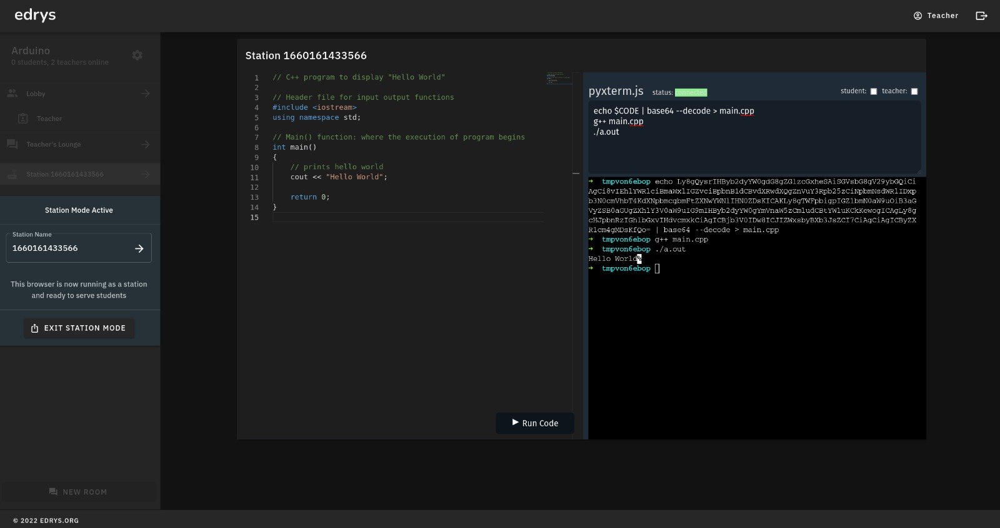

<!--
author:   Sebastian Zug, André Dietrich
email:    sebastian.zug@informatik.tu-freiberg.de & andre.dietrich@informatik.tu-freiberg.de

version:  0.0.1
language: de
narrator: English Female
mode:     Textbook

icon:     https://cross-lab.org/content/images/2021/11/Logo-mit-5-mehrfarbig.png
-->

[](https://liascript.github.io/course/?https://raw.githubusercontent.com/Cross-Lab-Project/presentations/main/GeCon_2022_Adaptability/CrossLab_GeCon2022.md)

# Adaptable Digital Labs
<h2>Motivation and Vision of the CrossLab Project </h2>

<div style="width: 46%; float: left">

| Affilation               | Team members                                                                                                            |
| ------------------------ | ----------------------------------------------------------------------------------------------------------------------- |
| TU Bergakademie Freiberg | Ines Aubel, Sebastian Zug, André Dietrich                                                                               |
| TU Ilmenau               | Johannes Nau,Karsten Henke, Pierre Helbing, Detlef Streitferdt                                                          |
| TU Dortmund              | Claudius Terkowsky, Konrad Boettcher, Tobias R. Ortelt, Marcel Schade, Norbert Kockmann, Tobias Haertel, Uwe Wilkesmann |
| Nordakademie             | Matthias Finck, Jan Haase, Franziska Herrmann, Louis Kobras, Bernhard Meussen, Marcus Soll, Daniel Versick             |

</div>

<!-- style="width: 50%; float: right" -->

--{{0}}--
The presentations we have already heard have described individual challenges that arise when implementing remote labs. I would like to systematize these difficulties against the background of an expanded digital laboratory concept and present our proposed solutions.

<h5>IEEE German Education Conference 2022 (GeCon 2022), Berlin, 11.08.2022</h5>


## CrossLab-Motivation

")<!-- style="width: 90%; display: block; margin-left: auto; margin-right: auto;"-->

> __How to characterize the implementation? It was hard coded related to components and content.__

## Cross-X

```ascii


                            +--------------------------------------------------------+
         +-->    elements   | composition of varying laboratory objects              |
         |                  +--------------------------------------------------------+
         |
         |                  +--------------------------------------------------------+
         +-->       types   | mixture of different types of laboratories             |
         |                  +--------------------------------------------------------+
CROSS ---+
         |                  +--------------------------------------------------------+
         +--> disciplinary  | sharing laboratories between different disciplines     |
         |                  +--------------------------------------------------------+
         |
         |                  +--------------------------------------------------------+
         +-->   university  | formation of a laboratory cluster                      |
                            +--------------------------------------------------------+

```

### Challenges

```ascii

                             .--------------.   .--------------.   .--------------.
                             | technical    |   | didactical   |   |organisational|
                             |              |   |              |   |              |
                            +--------------------------------------------------------+
         +-->    elements   | composition of varying laboratory objects              |
         |                  +--------------------------------------------------------+
         |                   |              |   |              |   |              |
         |                  +--------------------------------------------------------+
         +-->        types  | mixture of different types of laboratories             |
         |                  +--------------------------------------------------------+
CROSS ---+                   |              |   |              |   |              |
         |                  +--------------------------------------------------------+
         +->  disciplinary  | sharing laboratories between different disciplines     |
         |                  +--------------------------------------------------------+
         |                   |              |   |              |   |              |
         |                  +--------------------------------------------------------+
         +-->   university  | formation of a laboratory cluster                      |
                            +--------------------------------------------------------+
                             |              |   |              |   |              |
                             .--------------.   .--------------.   .--------------.
```

### Requierments

```ascii


                              |  technical     |  didactical     |  organisational
                 -------------+----------------+-----------------+------------------
                              | data exchange, | adjustment of   |
         +-->       elements  | real-time      | system recon-   |
         |                    | behaviour      | figuration      | digital skills
         |       -------------+----------------+ and intended    | of lecturers
         |                    | individual     | didactical      |
         +-->           type  | interfaces     | learning        |
         |                    | composability  | outcomes        |
CROSS ---+       -------------+----------------+-----------------+------------------
         |                    | remote re-     | specific        | access planning,
         +-->    disciplinary | configura-     | learning per-   | physical re-
         |                    | bility         | spectives       | configuration
         |       -------------+----------------+-----------------+ privacy,
         |                    | student access | differnt didac- | maintance and
         +-->      university |                | tical profiles  | monitoring
                              |                | and formalisms  |
                 -------------+----------------+-----------------+------------------
```

### Solutions

```json MicrocontrollerLab.config
{
  "id": "h8VGEabkElzbQY79PCsOQ",
  "createdBy": "Andre.Dietrich@informatik.tu-freiberg.de",
  "dateCreated": 1660161004140,
  "name": "Microcontroller Lab",
  "modules": [
    {
      "url": "https://cross-lab-project.github.io/edrys_module-editor/index.html",
      "config": "{ \"editorText\": \"Starting text in editor...\",  ....
    },
    {
      "url": "https://cross-lab-project.github.io/edrys_module-pyxtermjs/index.html",
      ...
      "stationConfig": "{ \"server\": \"http://localhost:5000/pty\" , \"execute\": \"pty-execute\" }",
      ...
    }
  ]
}
```




## Thanks for your interest

| Reference          | Link |
|--------------------|------|
| Project website    | [https://cross-lab.org/](https://cross-lab.org/) |
| Project repository |[https://github.com/Cross-Lab-Project](https://github.com/Cross-Lab-Project) |
| Edrys repository   | [https://edrys.org/](https://edrys.org/)|

> ___CrossLab_ is founded by Stiftung Innovation in der Hochschullehre [Link](https://stiftung-hochschullehre.de/projekt/crosslab/).__
